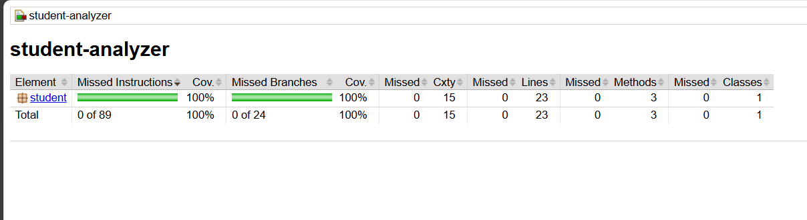

#  SOFT5 - Software Testing Lab
### Đại học

<p><b>Sinh viên:</b> Đinh Trần Nguyên</p> 
<p><b>Mã sinh viên:</b> BIT230292 </p>
<p><b>Giảng viên hướng dẫn:</b> Trương Anh Hoàng</p> 

##  Bài tập Làm quen Can't Unsee
<b>Jan 5th 2026<b/>
<p>Cant's UnSee Practition Test</p>


##  Bài tập Unit Testing với JUnit

### 1.  Mô tả bài toán
**Chủ đề:** Phân tích dữ liệu điểm số học sinh (`StudentAnalyzer`).

Mục tiêu là xây dựng một lớp xử lý logic để phân tích danh sách điểm số và viết các Test Case tự động để đảm bảo logic chạy đúng.

**Yêu cầu chức năng:**
1.  **`countExcellentStudents(List<Double> scores)`**:
    * Đếm số lượng học sinh Giỏi (điểm `>= 8.0`).
    * Bỏ qua các điểm không hợp lệ (nhỏ hơn 0 hoặc lớn hơn 10).
    * Trả về 0 nếu danh sách rỗng.
2.  **`calculateValidAverage(List<Double> scores)`**:
    * Tính điểm trung bình cộng của các điểm hợp lệ.
    * Bỏ qua điểm sai (`< 0` hoặc `> 10`).
    * Trả về 0 nếu không có điểm nào hợp lệ.

### 2. Cấu trúc dự án
Dự án được quản lý bằng **Maven**, tuân thủ cấu trúc chuẩn:

```bash
unit_test/
├── src/
│   ├── main/java/student/     # Source code chính (StudentAnalyzer.java)
│   └── test/java/student/     # Source code kiểm thử (StudentAnalyzerTest.java)
├── pom.xml                    # Khai báo thư viện JUnit Jupiter 5.9.2
└── README.md                  # Hướng dẫn chi tiết cho bài Lab
```
### 3. Minh chứng


## Bài tập Kiểm thử Tự động E2E với Cypress

### 1. Mô tả bài toán
**Chủ đề:** Kiểm thử tự động trang thương mại điện tử (`Swag Labs - SauceDemo`).

Mục tiêu là xây dựng dự án kiểm thử End-to-End (E2E) sử dụng framework Cypress để kiểm tra các luồng nghiệp vụ chính của người dùng từ đăng nhập đến thanh toán.

**Yêu cầu chức năng (Kịch bản kiểm thử):**
1. **`Login Test (login_spec.cy.js)`**:
    * **Đăng nhập thành công:** Kiểm tra người dùng đăng nhập với tài khoản hợp lệ (`standard_user`), hệ thống chuyển hướng đúng vào trang sản phẩm.
    * **Đăng nhập thất bại:** Kiểm tra hệ thống hiển thị thông báo lỗi chính xác khi nhập sai tài khoản hoặc mật khẩu.

2. **`Cart & Checkout Test (cart_spec.cy.js)`**:
    * **Thêm/Xóa giỏ hàng:** Kiểm tra chức năng thêm sản phẩm vào giỏ (icon hiển thị số lượng) và xóa sản phẩm khỏi giỏ (số lượng về 0).
    * **Sắp xếp sản phẩm:** Kiểm tra bộ lọc giá từ thấp đến cao (Low to High), đảm bảo sản phẩm đầu tiên có giá thấp nhất.
    * **Quy trình thanh toán:** Kiểm tra luồng điền thông tin giao hàng (`First Name`, `Last Name`, `Zip`) và hoàn tất đơn hàng.

### 2. Cấu trúc dự án
Dự án được quản lý bằng **NPM** và **Cypress**, tuân thủ cấu trúc chuẩn:

```bash
cypress/
├── e2e/
│   ├── login_spec.cy.js      # Kịch bản kiểm thử chức năng Đăng nhập
│   ├── cart_spec.cy.js       # Kịch bản kiểm thử Giỏ hàng & Thanh toán
│   │
├── fixtures/                 # Dữ liệu mẫu (nếu có)
└── support/                  # Các cấu hình hỗ trợ chung
├── cypress.config.js             # File cấu hình chính của Cypress
├── package.json                  # Khai báo thư viện Cypress và scripts

```
### 3. Minh chứng
1. **Minh chứng 1: Login Test**:


2. **Minh chứng 2: Cart & Checkout Test**:


## BÀI TẬP KIỂM TRA JUNIT VỚI KỸ THUẬT EP, DT, BVA VÀ TÍNH ĐỘ BAO PHỦ
### 1. Mô tả bài toán
**Đề bài**: Dùng phần code unit test trong bài tập trước để áp dụng kỹ thuật EP, DT, BVA và tính độ bao phủ. Sử dụng AI để đánh giá và cải thiện code unit test. Sử dụng công cụ để đo độ bao phủ
### 2. KẾT QUẢ
1. **Kỹ thuật DT, EP, BVA**:
* **Tính tổ chức**: Sử dụng test theo nhóm hành vi thay vì test rời rạc
* **Cover được vùng giá trị (EP).**
* **Cover được vùng giá trị (BVA - thông qua các giá trị 7.999, 8.0, 10.0, 10.1).**
* **Cover được vùng giá trị (DT - qua case Mixed và Edge cases).**
* **Chấm điểm:** 9.5/10
2. **Tính độ bao phủ**:
* Sử dụng thư viện Jacoco để đo độ bao phủ
* Độ bao phủ 100% 


Copyright © 2026 - Nguyen.DinhTran. Created for educational purpose.


